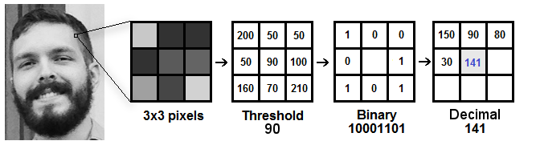
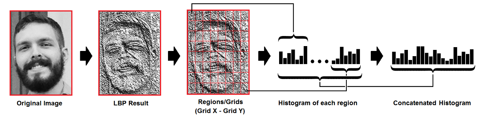

# Face-Rec

Using Python as well as the OpenCV Library we were able to build a face recognition model from scratch and train it to recognize our own as well as the faces of celebrities in real-time video feeds. A video sample of how the project works when run can be seen <b><a href='https://drive.google.com/open?id=1YECsdJISEK1AIWVZ5NoQqeTmWYP2k5oe'>here</a></b>

The Recognizer was first trained to recognize the user's face and then trained using a subset of images of celebrities taken from the Labelled Faces in the Wild (LFW) Dataset. All of these images are 250x250 in dimension and are fed as training data into the algorithm. 

The following were the goals set and accomplished in going through the project:
<ul>
  <li>Identification of a Face by using a classifier of choice: Haar Cascade Classifier</li>
<li>Procuring the training data and matching dimensional specifications</li>
<li>Setting up the Face Recognition feature by the use of algorithms involving Local Binary Patterns Histograms</li>
<li>Training the data on a small subset of the Labelled Faces in the Wild (LFW) Dataset</li>
<li>Running tests using real-time video feeds of pictures of celebrities in the dataset as well as the face of the user</li>
  </ul>

<ol>
  <em><b><li>data</li></b></em>
  
This folder houses the XML File of the Haar Cascade classifier which is used in discerning a face in the app

<em><b><li>images</li></b></em>
  
This folder contains the images on which the data was trained. the folders in which these images are kept is the label name for the all the images in that folder. These images are obtained from the <a href="http://vis-www.cs.umass.edu/lfw/">LFW (Labelled Faces in the Wild) Dataset</a>

<em><b><li>Recogniton.py</li></b></em>
  
This python file uses openCV and does appropriate manipulations using the video data to highlight the face identified. It uses the pretrained model as well as the labels from the labels.pickle to showcase the predictions made based on the video input data.

<em><b><li>face_train.py</li></b></em>
  
Here, the model is trained on the images in the images folder and with appropriate labels. The labels are then stored in a pickle object (namely labels.pickle) and the trained model is stored in trainer.yml for use during prediction

</ol>

<h3>Algorithm used in face detection: Haar Cascade Classifier</h3>

Haar feature-based cascade classifiers is an effective object detection method proposed in the paper, “Rapid Object Detection using a Boosted Cascade of Simple Features” in 2001by Paul Viola and Michael Jones. The algorithm consists of a machine learning based approach where the classifier learns from sets of positive(images where there are faces) and negative images(images where there are no faces). Using this as the training data, the classifier can recognize faces to a good accuracy.

The classifier given in OpenCV is pre-trained with a lot of positive images and negative images. By this mode of training the classifier learns the ‘features’ of a face and is then ready to apply it to the test image data. The actual in-depth working of this algorithm is more nuanced than this and we have just given a surface level description of its working above.

<h3>Algorithm used in face Recognition: LBPHFaceRecognizer</h3>
<ul>
<li>For this algorithm to be computationally efficient, the images must be in grayscale. </li>
<li>Once the grayscale images of the training data are obtained, we take part of the image as windows of some dimension (say, 3x3) and convert it into their respective intensities (0-255), thus forming an intensity matrix. </li>
<li>Using this intensity matrix we move onto the next step. The central value in the matrix is taken as the threshold and all values of the matrix lower than this value are set to a 0 and all values higher than it are set to a 1.</li>
<li>The matrix is now filled with 1s and 0s and the central element is left empty.</li> 
<li>The matrix is then taken and encoded into a row-wise binary sequence.</li>
<li>This binary value is then converted back into a decimal value and replaces the central value (of the previous matrix) in the original image.</li>
<li>After this the next pixel is taken as the central element in the 3x3 matrix and the above computations are repeated.</li>
<li>The process used in the code uses the same principles as above but is implemented in a circular fashion called circular LBP</li>

<li>After the intensities are realized, the original image is divided into grids.</li>
<li>Pixel intensities are taken from these grids and a histogram is created which represents these individual pixel intensities on a grid by grid basis.</li>
<li>The histograms of one grid are compiled to give a concatenated histogram.</li>
<li>The same above operations are repeated with the test image/video and we compare the concatenated histograms obtained by calculated the ‘distance’ between the two.</li>
<li>The distance is calculated by means of various approaches such as chi-square distance, absolute value, Euclidean distance. After calculation this distance represent the confidence (lesser the confidence, greater the chance of it being the same object/face)</li>
<li>We then use a threshold to say that if the confidence is below this value, we consider it to be a positive match.</li>

</ul>

<h4>Training:</h4>
  <ul>
<li>In the training process the images are queried from a directory in the system. </li>
<li>Labels and associated id numbers are made from these images and dumped into a ‘pickle’ file which can then be used during runtime.</li>
<li>The x_train and y_train lists containing the region of interest and the id of corresponding labels respectively are made.</li>
<li>The LBPHFaceRecognizer is trained with these lists and the trained model is stored in a ‘trainer.yml’ file which can be used at runtime.</li>
<li>Thus the model is trained and is ready to be used</li>
  </ul>
<h4>Recognition:</h4>
  <ul>
<li>The model from the training phase is read in this phase.</li>
<li>Using openCV features, the video stream is setup.</li>
<li>The Haar Cascade Classifier is used in the detection of the face while the pretrained LBPH-based model is utilized in the recognition of those faces. </li>
  </ul>
  
<h2>Thanks for Reading!</h2>
